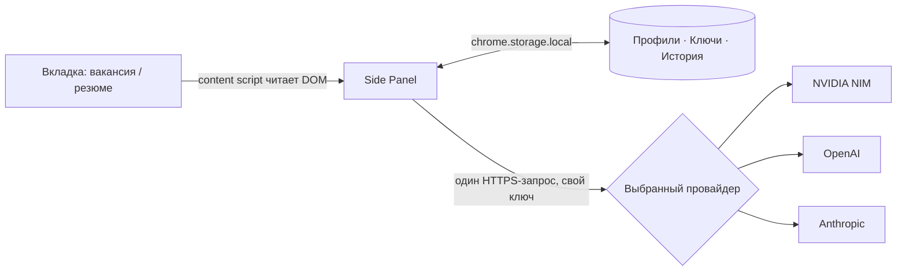

<p align="center">
  
</p>

<p align="center">
  
  
  
  
</p>

<p align="center">
  Расширение для Chrome/Edge: за секунды показывает, стоит ли откликаться на вакансию —
  с прозрачным разбором по факторам, а не голым «% совпадения».
</p>

---

## Зачем

Teal, Jobscan, Huntr, Careerflow — у всех один и тот же чёрный ящик: число без
объяснений. Здесь индекс = 50 (базовый уровень) + сумма конкретных факторов,
каждый со своим весом и обоснованием. Видно ровно то, что решило вердикт.

> | Фактор | Δ |
> |---|---:|
> | базовый уровень | 50 |
> | Стек совпадает: Python, REST API | +18 |
> | Домен: автоматизация процессов | +12 |
> | n8n/Zapier — прямое попадание | +8 |
> | Нет опыта с Kubernetes | −10 |
> | Просят английский C1, у кандидата B2 | −4 |
> | **индекс** | **74** |

Плюс сопроводительное письмо, готовое к отправке без правок, и ноль бэкенда —
резюме и API-ключ идут напрямую в API провайдера, без посредника.

## Возможности

| | |
|---|---|
| **Разбор по факторам** | Ledger-waterfall вместо одного числа — видно, что именно подняло или снизило индекс |
| **Письмо без правок** | Готово к отправке: без плейсхолдеров, без канцелярита |
| **Несколько резюме** | Именованные профили, импорт с hh.ru в один клик прямо со страницы резюме |
| **Оценка резюме** | Отдельно от вакансии — качество самого резюме, до отклика |
| **Аналитика откликов** | История с отметкой «откликнулся», донат по вердиктам, тренд индекса |
| **4 провайдера** | DeepSeek V4 Flash / GLM-5.2 (NVIDIA NIM), OpenAI, Anthropic — свой ключ, авто-повтор при rate limit |

Расширение читает только DOM текущей вкладки: без фонового парсинга списков
вакансий, без авто-откликов, без обхода авторизации площадок. Отправка отклика
— всегда вручную, на самой площадке.

## Быстрый старт

1. **Установка.** `chrome://extensions` (или `edge://extensions`) → включить
   «Режим разработчика» → «Загрузить распакованное расширение» → выбрать эту
   папку.
2. **Ключ.** Получить у нужного провайдера — [NVIDIA NIM](https://build.nvidia.com/),
   [OpenAI](https://platform.openai.com/api-keys) или
   [Anthropic](https://console.anthropic.com/settings/keys) — нужен только ключ
   той модели, которую будешь использовать. Вставить в настройках расширения (⚙),
   выбрать активную модель.
3. **Профиль.** Открыть свою страницу резюме на hh.ru → в панели →
   «Импортировать резюме с этой страницы». Либо вставить текст вручную.
4. **Проверка.** Открыть вакансию на hh.ru / LinkedIn / Upwork → иконка
   расширения → «Проверить соответствие» → вердикт, разбор, письмо.

## Профили и резюме

- Несколько именованных профилей — переключаются select'ом в панели, полностью
  управляются (переименование/удаление) в настройках.
- Импорт с hh.ru обновляет существующий профиль при повторном импорте того же
  резюме — без дублей.
- LinkedIn/Upwork своих резюме не читают — там только вручную через textarea.

## Приватность и архитектура

Ничего, кроме одного HTTPS-запроса к выбранному провайдеру, никуда не уходит:
без бэкенда, без аналитики, без телеметрии. Профиль, ключи и история — только
в `chrome.storage.local` этого браузера.



Исходники открыты — можно проверить самому, а не верить на слово.

## Структура проекта

```
manifest.json           MV3: permissions, side panel, content scripts
background.js           service worker: вызовы провайдеров
shared/constants.js     провайдеры, модели, профиль по умолчанию, промпты
content-scripts/        DOM-экстракторы под каждую площадку
sidepanel/              UI панели (тёплая светлая тема)
options/                настройки: ключи, модель, профиль, язык писем
icons/                  генерируются: python tools/make_icons.py
tools/preview.html      статичный предпросмотр панели (без браузерных API)
docs/hero.svg           баннер README
```

## Заметки

- **Селекторы площадок ориентировочные.** Вёрстка hh.ru / LinkedIn / Upwork
  меняется — если текст не подтягивается, актуализировать селекторы в
  `content-scripts/extractor-*.js` или вставить текст вручную (fallback есть).
- Провайдеры и модели — в `shared/constants.js` (`PROVIDERS`, `MODELS`). Если
  API отвечает `model not found`, поменять id модели там же.
- История — последние 50 проверок.

## Вклад в проект

Issues и PR приветствуются — особенно по актуализации селекторов площадок,
они меняются вместе с вёрсткой hh.ru / LinkedIn / Upwork.

Если проект оказался полезен — можно поставить звезду репозиторию или
[поддержать донатом](https://www.tbank.ru/cf/1cYvs7KjikV).

## Лицензия

MIT — см. [LICENSE](LICENSE).
