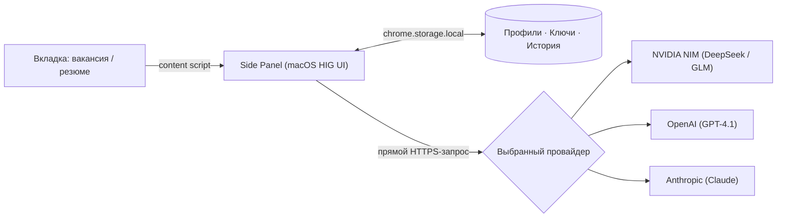

<p align="center">
  <picture>
    <source media="(prefers-color-scheme: dark)" srcset="docs/hero-dark.svg">
    
  </picture>
</p>

<h1 align="center">Job Fit Copilot v0.2.0</h1>
<p align="center">
  > AI-ассистент для проверки соответствия вакансий, ATS-анализа резюме и генерации сопроводительных писем — прямо в браузере.<br>
  hh.ru · LinkedIn · Upwork · DeepSeek V4 Flash / GLM-5.2 / GPT-4.1 / Claude Sonnet 4.6 — свой ключ, без бэкенда.
</p>

<p align="center">
  
  
  
  
  
  <a href="https://github.com/zhurik77/jobfitcopilot/releases/latest"></a>
</p>

<p align="center">
  <a href="#возможности">Возможности</a> ·
  <a href="#быстрый-старт">Быстрый старт</a> ·
  <a href="#стек">Стек</a> ·
  <a href="#чем-отличается">Чем отличается</a> ·
  <a href="#приватность-и-архитектура">Приватность</a> ·
  <a href="#changelog">Changelog</a>
</p>

<p align="center">
  <picture>
    <source media="(prefers-color-scheme: dark)" srcset="docs/features-dark.svg">
    
  </picture>
</p>

---

## Возможности

| Фича | Описание |
|---|---|
| **Разбор по факторам (fit-check)** | Прозрачный ledger-разбор (база 50 + дельты совпадений и несовпадений по факторам) |
| **Точечный ATS-разбор** | Разделение требований на обязательные и желательные (`hard_requirements` vs `nice_to_have`), смысловой мэтчинг (`matched_as`), критичные пробелы и точечные правки с кнопкой «Скопировать» |
| **ATS из истории** | Выбор ранее сохранённых вакансий из истории в один клик без повторного ввода текста |
| **Сопроводительные письма** | Сопоставление требований с реальным опытом кандидата, выбор тона (Нейтральный / Уверенный), отработка red flags и защита от клише |
| **Аналитика использования** | Статистика проверок (всего, 7 и 30 дней), график недельной активности, распределение вердиктов и топ источников |
| **Apple-Style UI (macOS HIG)** | SF Pro типографика, нативный Segmented Control, визуальная слоистость с `backdrop-filter: blur`, закруглённые карточки и векторные иконки SF Symbols |

## Быстрый старт (Установка)

1. **Скачать или клонировать репозиторий:**
   ```bash
   git clone https://github.com/zhurik77/jobfitcopilot.git
   ```
2. **Загрузить в браузер:**
   Перейти в `chrome://extensions` (или `edge://extensions`) → включить **«Режим разработчика»** → нажать **«Загрузить распакованное расширение»** → выбрать папку `jobfitcopilot/`.
3. **Настроить API-ключ:**
   Нажать на иконку расширения → открыть настройки (⚙) → вставить API-ключ выбранного провайдера ([NVIDIA NIM](https://build.nvidia.com/), [OpenAI](https://platform.openai.com/), [Anthropic](https://console.anthropic.com/)).
4. **Запустить разбор:**
   Открыть вакансию на hh.ru / LinkedIn / Upwork → открыть боковую панель (Side Panel) → запустить Fit-Check или ATS-разбор.

## Стек

- **Manifest V3** (Chrome / Edge Extension API)
- **Direct LLM Provider API**: NVIDIA NIM (DeepSeek V4 Flash, GLM-5.2), OpenAI (GPT-4.1), Anthropic (Claude Sonnet 4.6)
- **Local Storage**: `chrome.storage.local` (без бэкенда и облачных серверов)
- **Design System**: Vanilla CSS, macOS HIG, SF Symbols Iconography, System Accent `#FF9500`

## Чем отличается

| | Job Fit Copilot v0.2.0 | Teal / Jobscan / Huntr / Careerflow |
|---|---|---|
| **Индекс совпадения** | Прозрачный ledger: база 50 + дельта и объяснение по каждому фактору | Один % без разбивки причин |
| **ATS-анализ** | Точечный разбор по обязательным и желательным требованиям со смысловым мэтчингом | Простая сверка ключевых слов |
| **Хранение данных** | Только `chrome.storage.local` этого браузера | Облачный аккаунт |
| **Бэкенд** | Отсутствует — прямой запрос к выбранному AI-провайдеру | Есть — обработка на их серверах |
| **Стоимость** | Бесплатно и Open Source | Платная подписка |

## Приватность и архитектура

Всё содержимое профиля, API-ключи и история проверок хранятся исключительно в `chrome.storage.local` вашего браузера.



## Лицензия

MIT — см. [LICENSE](LICENSE).
