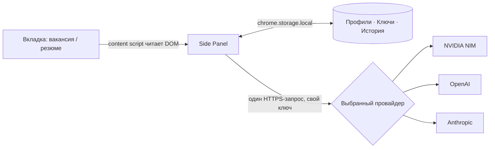

# Job Fit Copilot


Браузерное расширение (Chrome/Edge, Manifest V3) для соискателей: на странице
вакансии hh.ru / LinkedIn / Upwork показывает в боковой панели, стоит ли
откликаться, — не просто «% совпадения», а прозрачный разбор по факторам
(ledger: базовый уровень 50 + каждый фактор своей дельтой), вердикт
ОТКЛИКАТЬСЯ / С ОГОВОРКАМИ / ПРОПУСТИТЬ и готовое к отправке сопроводительное
письмо. Работает с любым из четырёх провайдеров на выбор: DeepSeek V4 Flash
или GLM-5.2 через NVIDIA NIM, либо напрямую OpenAI/Anthropic — свой ключ, без
посредников.

Расширение читает только DOM уже открытой вкладки: без фонового парсинга
списков вакансий, без авто-откликов, без обхода авторизации площадок. Отправка
отклика — всегда вручную на самой площадке.

## Почему не как везде

Большинство похожих инструментов (Teal, Jobscan, Huntr, Careerflow) дают
голый «% совпадения» без объяснения, откуда он взялся. Здесь индекс — это
сумма конкретных факторов, каждый со своим весом и текстовым обоснованием;
видно ровно то, что решило вердикт, а не чёрный ящик. Плюс: ноль бэкенда —
твой резюме и API-ключ не проходят через сторонний сервер, только напрямую
в API выбранного провайдера.

Пример реального разбора (индекс = 50 + сумма факторов):

| Фактор | Δ |
|---|---:|
| базовый уровень | 50 |
| Стек совпадает: Python, REST API | +18 |
| Домен: автоматизация процессов | +12 |
| n8n/Zapier — прямое попадание | +8 |
| Нет опыта с Kubernetes | −10 |
| Просят английский C1, у кандидата B2 | −4 |
| **индекс** | **74** |

## Возможности

- Разбор совпадения по факторам (ledger) с визуальным waterfall, а не одно число
- Сопроводительное письмо, готовое к отправке без правок — без плейсхолдеров
- Несколько именованных профилей/резюме, импорт прямо со страницы hh.ru в один клик
- Отдельная оценка качества самого резюме (не привязана к вакансии)
- История проверок с отметкой «откликнулся» и аналитикой (донат вердиктов, тренд индекса)
- Четыре провайдера на выбор с автоматическим повтором при перегрузке (rate limit)

## Установка (unpacked)

1. Открыть `chrome://extensions` (или `edge://extensions`).
2. Включить «Режим разработчика» (Developer mode).
3. «Загрузить распакованное расширение» (Load unpacked) → выбрать эту папку
   (`job-fit-copilot/`).

## Настройка (один раз)

1. Получить ключ у нужного провайдера: NVIDIA NIM — https://build.nvidia.com/,
   OpenAI — https://platform.openai.com/api-keys, Anthropic —
   https://console.anthropic.com/settings/keys. Нужен только ключ той модели,
   которую собираешься использовать, остальные поля можно оставить пустыми.
2. Кликнуть иконку расширения → ⚙ в правом верхнем углу панели.
3. Вставить нужный API-ключ, выбрать активную модель, проверить профиль
   кандидата, выбрать язык писем.
   Всё хранится локально в `chrome.storage.local`, ключи уходят только
   напрямую в API выбранного провайдера.

## Использование

1. Открыть страницу вакансии (hh.ru / LinkedIn / Upwork).
2. Кликнуть иконку расширения — справа откроется панель, текст вакансии
   подтянется автоматически (если страница была открыта до установки
   расширения — нажать «обновить со страницы» или перезагрузить страницу).
3. «Проверить соответствие» → вердикт, score, обоснование, сильные стороны,
   флаги.
4. «Написать сопроводительное письмо» → «Скопировать».
   Отправка отклика — вручную на площадке.

## Профили кандидата (несколько резюме)

- Открыть свою страницу резюме на hh.ru (`hh.ru/resume/...`, залогиненным) →
  в панели, в блоке «Мой профиль» → «Импортировать резюме с этой страницы».
  Импорт создаёт именованный профиль (или обновляет уже импортированный
  с этого же резюме — без дублей) и делает его активным.
- Несколько профилей (разные резюме/позиционирование) переключаются select'ом
  в панели или полностью управляются (переименование/удаление) в настройках.
- LinkedIn/Upwork своих резюме не читают — там только вручную через textarea.

## Структура

```
manifest.json            # MV3: permissions, side panel, content scripts
background.js            # service worker: вызовы провайдеров (NVIDIA NIM/OpenAI/Anthropic)
shared/constants.js      # провайдеры, модели, профиль по умолчанию, системные промпты
content-scripts/         # DOM-экстракторы под каждую площадку
sidepanel/               # UI панели (тёплая светлая тема, паперный дизайн)
options/                 # настройки: API-ключ, профиль, язык писем
icons/                   # генерируются: python tools/make_icons.py
tools/preview.html       # статичный предпросмотр панели (дизайн без браузерных API)
```

## Заметки

- **Селекторы площадок ориентировочные.** Вёрстка hh.ru / LinkedIn / Upwork
  меняется. Если текст не подтягивается — открыть DevTools на странице
  вакансии и актуализировать селекторы в `content-scripts/extractor-*.js`,
  либо вставить текст вручную в панели (fallback предусмотрен).
- Провайдеры и модели заданы в `shared/constants.js` (`PROVIDERS`, `MODELS`),
  выбор активной модели — в настройках. Если API отвечает `model not found` —
  проверить id модели там же (для `openai`/`anthropic` названия моделей могли
  устареть с момента написания — актуализировать под доступные на аккаунте).
- История — последние 50 проверок, в `chrome.storage.local`.

## Приватность

Ничего, кроме API-запроса к выбранному провайдеру, никуда не уходит:
без бэкенда, без аналитики, без телеметрии. Профиль, ключи и история — только
в `chrome.storage.local` этого браузера. Исходники открыты — можно проверить
самому, а не верить на слово.



Никакого промежуточного сервера между панелью и провайдером — только то, что
на схеме.

## Вклад в проект

Issues и PR приветствуются — особенно по актуализации селекторов площадок
(`content-scripts/extractor-*.js`), они меняются вместе с вёрсткой hh.ru /
LinkedIn / Upwork и требуют регулярной сверки с реальным DOM.

## Лицензия

MIT — см. [LICENSE](LICENSE).
