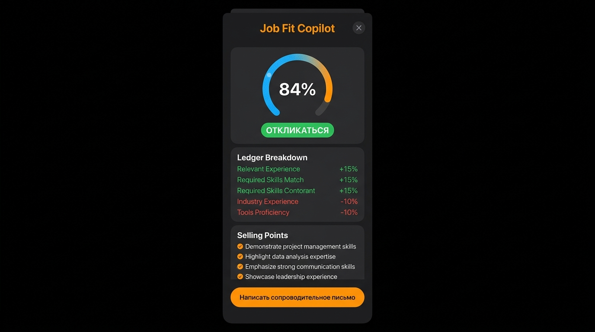
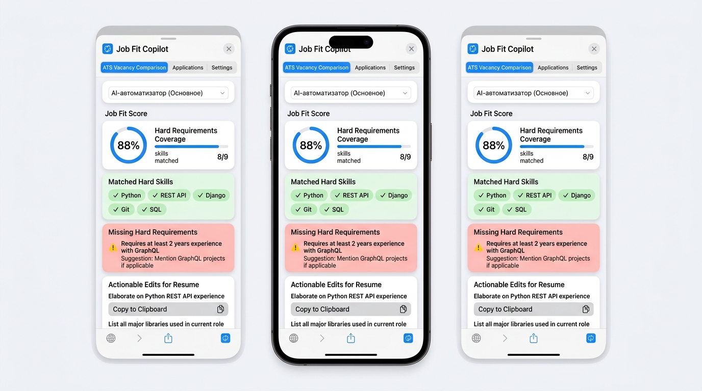
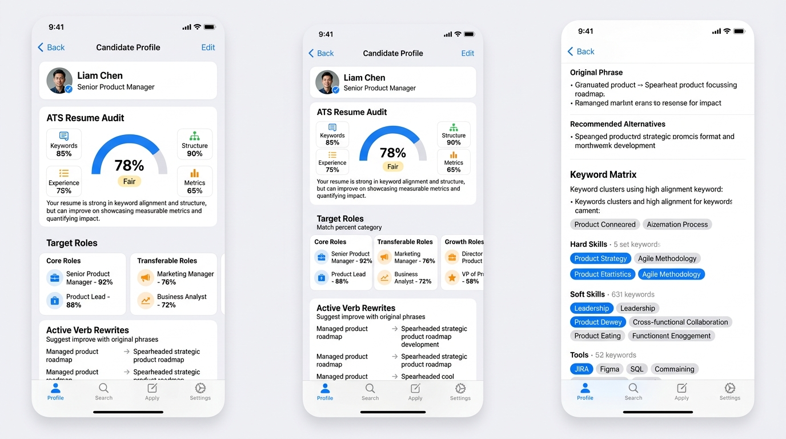
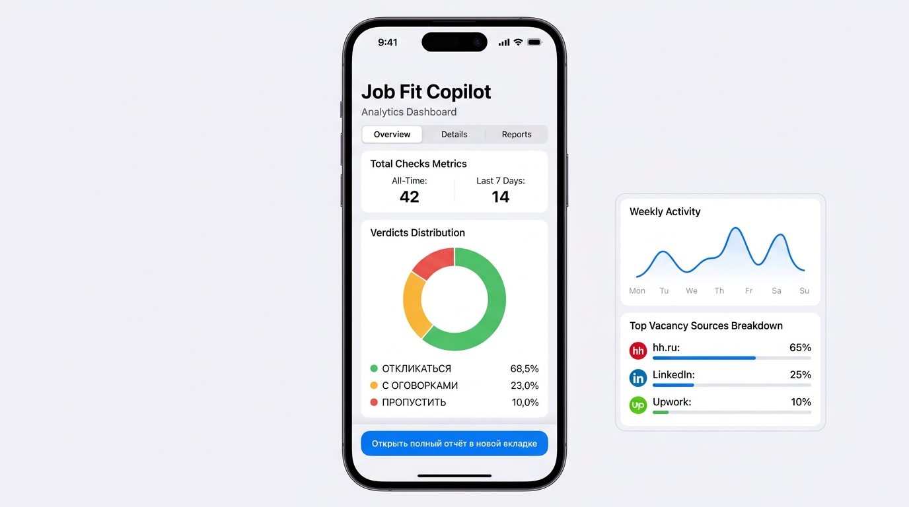

<p align="center">
  <picture>
    <source media="(prefers-color-scheme: dark)" srcset="docs/hero-dark.svg">
    
  </picture>
</p>

<h1 align="center">Job Fit Copilot v0.3.1</h1>
<p align="center">
  > AI-ассистент для проверки соответствия вакансий, глубокого ATS-анализа резюме, мульти-резюме сравнения и генерации сопроводительных писем — прямо в браузере.<br>
  hh.ru · LinkedIn · Upwork · DeepSeek V4 Flash / GLM-5.2 / GPT-4.1 / Claude Sonnet 4.6 — свой ключ, без бэкенда.
</p>

<p align="center">
  
  
  
  
  
  <a href="https://github.com/zhurik77/jobfitcopilot/releases/latest"></a>
</p>

<p align="center">
  💛 <b>Поддержать проект:</b> <a href="https://www.tbank.ru/cf/1cYvs7KjikV" target="_blank" rel="noopener">https://www.tbank.ru/cf/1cYvs7KjikV</a>
</p>

<p align="center">
  <a href="#быстрый-старт">Быстрый старт</a> ·
  <a href="#возможности">Возможности</a> ·
  <a href="#модели-и-провайдеры">Модели и провайдеры</a> ·
  <a href="#экспорт-отчётов">Экспорт отчётов</a> ·
  <a href="#чем-отличается">Чем отличается</a> ·
  <a href="#стек">Стек</a> ·
  <a href="#changelog">Changelog</a>
</p>

<p align="center">
  <picture>
    <source media="(prefers-color-scheme: dark)" srcset="docs/features-dark.svg">
    
  </picture>
</p>

---

## ⚡ Быстрый старт

1. **Скачать репозиторий:**
   ```bash
   git clone https://github.com/zhurik77/jobfitcopilot.git
   ```
2. **Загрузить в браузер:**
   Перейти в `chrome://extensions` → включить **«Режим разработчика»** → **«Загрузить распакованное расширение»** → выбрать папку `jobfitcopilot/`.
3. **Настроить API-ключ:**
   Открыть настройки расширения (⚙) → вставить ключ выбранного провайдера ([NVIDIA NIM](https://build.nvidia.com/), [OpenAI](https://platform.openai.com/), [Anthropic](https://console.anthropic.com/)).
4. **Запустить разбор:**
   Перейти на вакансию на hh.ru / LinkedIn / Upwork → открыть панель расширения (Side Panel) → выбрать режим разбора.

---

## 🔥 Возможности

| Режим | Описание |
|---|---|
| **Разбор по факторам (Fit-Check)** | База 50 + дельты совпадений со ссылками на конкретные факты из резюме и вакансии |
| **Точечный ATS-разбор под конкретное резюме** | Сравнение вакансии с любым из сохранённых именованных резюме (`hard_requirements` vs `nice_to_have`, смысловой мэтчинг `matched_as`, критичные пробелы и точечные правки) |
| **Система мульти-резюме (`savedResumes`)** | Хранение нескольких именованных резюме (например, *«AI-automation»* и *«Business Analyst»*) для точного таргетинга разных позиционирований |
| **Глубокий ATS-аудит (20 ролей)** | Взвешенный скоринг по 4 критериям (ключевые слова 35%, структура 20%, релевантность 25%, плотность метрик 20%), построчный разбор опыта с активными глаголами, факторы ранжирования hh.ru |
| **Топ-20 подходящих ролей (8/7/5)** | Точно 20 ролей: 8 Core (прямое попадание), 7 Transferable (смежные навыки), 5 Growth (рост) с честными указаниями разрывов |
| **Карта ключевых слов и Чек-лист** | 3 кластера ключевых терминов + 5 конкретных шагов оптимизации резюме |
| **Сопроводительные письма** | Персонализированные письма с защитой от клише, сопоставлением требований с опытом и выбором тона (Нейтральный / Уверенный) |
| **Экспорт отчётов** | Открытие отчётов в новой вкладке (`chrome.tabs.create`) и скачивание в виде автономных `.html` файлов |
| **iOS Mobile UI (iOS HIG)** | Нижний iOS Tab Bar, Large Title header, iOS Grouped Card style (`#F2F2F7`), капсульные кнопки |

### 📸 Интерфейс и режимы работы

#### 1. Проверка соответствия вакансии (Fit-Check)


#### 2. Точечный ATS-разбор вакансии под сохранённые резюме


#### 3. Глубокий ATS-аудит кандидата (20 целевых ролей и 4 субоценки)


#### 4. Аналитика использования и экспорт автономных отчётов


---

## 🤖 Модели и провайдеры

Запросы отправляются напрямую из браузера на эндпоинт выбранного провайдера. Ваши ключи хранятся только локально в `chrome.storage.local`.

- **DeepSeek V4 Flash** (`deepseek-ai/deepseek-v4-flash`) via [NVIDIA NIM](https://build.nvidia.com/)
- **GLM-5.2** (`z-ai/glm-5.2`) via [NVIDIA NIM](https://build.nvidia.com/)
- **GPT-4.1** (`gpt-4.1`) via [OpenAI](https://platform.openai.com/)
- **Claude Sonnet 4.6** (`claude-sonnet-4-6`) via [Anthropic](https://console.anthropic.com/)

---

## 📄 Экспорт отчётов

Нажмите **«Открыть полный отчёт»** или **«Скачать отчёт (.html)»** в панелях **Профиль** или **Аналитика**, чтобы мгновенно сформировать автономный HTML-документ со всеми графиками, матрицами и построчным аудитом.

---

## 💡 Чем отличается

1. **Backend None (100% Client-Side):** Отсутствуют промежуточные серверы, ваши данные и API-ключи никогда не покидают ваш браузер.
2. **Гибкий выбор из 4 LLM-провайдеров:** Работает как на бесплатном ключе NVIDIA NIM, так и на официальных ключах OpenAI и Anthropic.
3. **Мульти-резюме таргетинг:** Поддержка нескольких сохранённых резюме под разное позиционирование на hh.ru / LinkedIn.
4. **Строгий фильтр клише:** Промпты заблокированы от генерации "заинтересован", "высококвалифицированный" и других пустых штампов.

---

## 🛠 Стек

- **Manifest V3** (`storage`, `activeTab`, `scripting`, `sidePanel`, `tabs`)
- **Direct LLM Provider APIs**: NVIDIA NIM / OpenAI / Anthropic
- **Design System**: Vanilla CSS, iOS HIG Aesthetic, SF Symbols
- **Storage**: `chrome.storage.local`

---

## 📋 Чек-лист перед релизом

- [x] Версия в `manifest.json`, `README.md` и `CHANGELOG.md` совпадает.
- [x] `node -c` завершается без ошибок по всем JS-файлам.
- [x] Автономный workflow `.github/workflows/release.yml` настроен.
- [x] Донат-ссылка присутствует в шапке README: `https://www.tbank.ru/cf/1cYvs7KjikV`.

---

## 💛 Поддержка проекта

Если вам помогает Job Fit Copilot, вы можете поддержать разработку:
👉 **[Поддержать проект на Т-Банк](https://www.tbank.ru/cf/1cYvs7KjikV)**

## Лицензия

MIT — см. [LICENSE](LICENSE).
