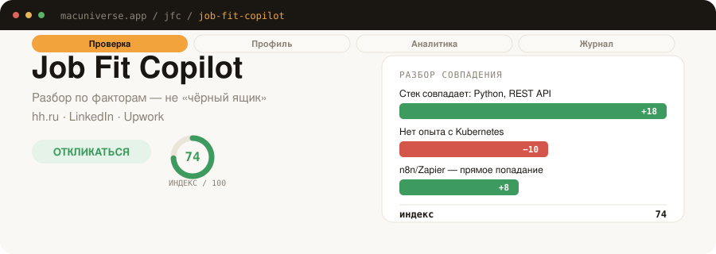

<p align="center">
  <picture>
    <source media="(prefers-color-scheme: dark)" srcset="docs/hero-dark.svg">
    
  </picture>
</p>

<h1 align="center">Job Fit Copilot v0.3.0</h1>
<p align="center">
  > AI-ассистент для проверки соответствия вакансий, глубокого ATS-анализа резюме и генерации сопроводительных писем — прямо в браузере.<br>
  hh.ru · LinkedIn · Upwork · DeepSeek V4 Flash / GLM-5.2 / GPT-4.1 / Claude Sonnet 4.6 — свой ключ, без бэкенда.
</p>

<p align="center">
  
  
  
  
  
  <a href="https://github.com/zhurik77/jobfitcopilot/releases/latest"></a>
</p>

<p align="center">
  <a href="#возможности">Возможности</a> ·
  <a href="#быстрый-старт">Быстрый старт</a> ·
  <a href="#экспорт-отчётов">Экспорт отчётов</a> ·
  <a href="#стек">Стек</a> ·
  <a href="#чем-отличается">Чем отличается</a> ·
  <a href="#changelog">Changelog</a>
</p>

<p align="center">
  <picture>
    <source media="(prefers-color-scheme: dark)" srcset="docs/features-dark.svg">
    
  </picture>
</p>

---

## Возможности

| Фича | Описание |
|---|---|
| **Разбор по факторам (fit-check)** | Прозрачный ledger-разбор (база 50 + дельты совпадений и несовпадений по факторам) |
| **Точечный ATS-разбор вакансии** | Сравнение резюме с вакансией: обязательные (`hard_requirements`) и желательные (`nice_to_have`), смысловой мэтчинг (`matched_as`), критичные пробелы и точечные правки с кнопкой «Скопировать» |
| **Глубокий ATS-аудит резюме** | Взвешенный скоринг по 4 критериям (ключевые слова 35%, структура 20%, релевантность 25%, плотность метрик 20%), построчный разбор опыта с активными глаголами, факторы ранжирования hh.ru и трекинг прогресса между аудитами |
| **Топ-20 подходящих ролей (8/7/5)** | Точно 20 ролей в пропорции: 8 Core (прямое попадание), 7 Transferable (смежные навыки), 5 Growth (рост/смена вектора) с честным указанием разрыва |
| **Карта ключевых слов и Чек-лист** | Кластеры ключевых терминов (Hard Skills, Домен, Глаголы) + чек-лист из 5 конкретных шагов оптимизации |
| **Сопроводительные письма** | Сопоставление требований с реальным опытом кандидата, выбор тона (Нейтральный / Уверенный), отработка red flags и защита от клише |
| **Экспорт отчётов** | Открытие автономных отчётов (ATS-аудит и аналитика) в новой вкладке браузера (`chrome.tabs.create`) и скачивание в виде `.html` файла |
| **iOS Mobile UI (iOS HIG)** | Нижний iOS Tab Bar навигации, Large Title в шапке, iOS Grouped Lists (`#F2F2F7`), капсульные кнопки (`border-radius: 999px`) и лёгкая SF Symbols иконографика |

## Экспорт отчётов

Нажмите **«Открыть полный отчёт»** или **«Скачать отчёт (.html)»** в боковой панели, чтобы сформировать единый документ со всеми 20 ролями, матрицей ключевых слов, построчным разбором и графиками аналитики.

## Быстрый старт (Установка)

1. **Скачать или клонировать репозиторий:**
   ```bash
   git clone https://github.com/zhurik77/jobfitcopilot.git
   ```
2. **Загрузить в браузер:**
   Перейти в `chrome://extensions` (или `edge://extensions`) → включить **«Режим разработчика»** → нажать **«Загрузить распакованное расширение»** → выбрать папку `jobfitcopilot/`.
3. **Настроить API-ключ:**
   Нажать на иконку расширения → открыть настройки (⚙) → вставить API-ключ выбранного провайдера ([NVIDIA NIM](https://build.nvidia.com/), [OpenAI](https://platform.openai.com/), [Anthropic](https://console.anthropic.com/)).
4. **Запустить разбор:**
   Открыть вакансию на hh.ru / LinkedIn / Upwork → открыть боковую панель (Side Panel) → запустить Fit-Check, ATS-разбор или Глубокий ATS-аудит резюме.

## Стек

- **Manifest V3** (Chrome / Edge Extension API с разрешениями `storage`, `activeTab`, `scripting`, `sidePanel`, `tabs`)
- **Direct LLM Provider API**: NVIDIA NIM (DeepSeek V4 Flash, GLM-5.2), OpenAI (GPT-4.1), Anthropic (Claude Sonnet 4.6)
- **Local Storage**: `chrome.storage.local` (без бэкенда и облачных серверов)
- **Design System**: Vanilla CSS, iOS HIG Aesthetic, Bottom Tab Bar Navigation, SF Symbols Iconography

## Лицензия

MIT — см. [LICENSE](LICENSE).
